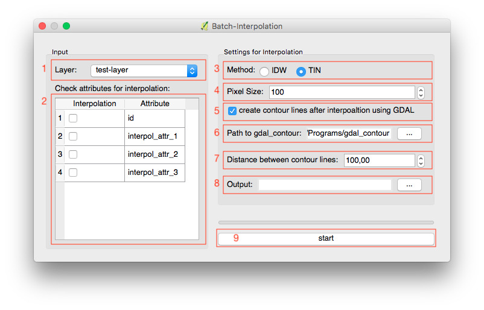

# Batch-Interpolation
A QGIS-plugin, which creates a batch process of the QGIS Raster Interpolation (TIN or IDW) and gdal_contour.

## Goal of the project
Imagine you have a point layer with different attributes and you want to create a raster interpolation for each of the attributes. It can be realy annoying to start the interpolation for each attribute manually. And the interpolation of TIN and IDW from QGIS (under the menu Raster-Interpolation) can not be used in the graphic process modeller. With this plugin the user must just select the attributes, which should be used for the interpolation (instead of the z-coordinate) and than starts the batch process. The plugin allows also to create contour lines of each created raster file using gdal_contour in the same batch process. The raster files and the contour lines will be calculated in a row without the need of starting a new calculation for the next attribute.

## Changelog
1.0.0 - initial release

## Usage
The following screenshot shows the user interface of the plugin. The graphic elements are nummerized and described below.
 

 
1. This combobox contains all layers of the current QGIS-project. Please note, that just vector layers of the geometry type POINT can be used for the interpolation without unexpacted results and problems (see the chapter <i>Hints</i> below).
2. This table shows all attributes of the selected layer in 1. If an attribute should be used for interpolation, check the checkbox in the same row. All unchecked attributes will be ignored.
3. Two methods for the raster interpolation are availlable: TIN (Delaunay-Triangulation) and IDW. Both methods using PYQGIS-functions, not external libraries.
4. Choose the size of each pixel (cell size) of the raster file. The value is in map units, i.e. it is recommended to choose a metric CRS. Just integer values are possible.
5. Check this checkbox, if contour lines of the interpolated raster files should be calculated. If this checkbox is unchecked, the graphic elements in 6, 7 and 8 will be disabled.
6. Choose or insert the absolute path to gdal_contour, which will be used for creating contour lines.
7. Insert a double value for defining the distance between the contour lines (if the QGIS-project has a metric-CRS, this value is in meters).
8. Choose a folder for storing the output (raster files and eventually contour lines).
9. Start the batch process!

## Hints
- Each layer of the current QGIS-project will be shown in the combobox (1), i.e. raster layers too. If such a layer will be selected, the plugin will throw an exception because raster layers have not attributes. If the first layer (the layer on top) is a raster layer, than the plugin will not start. Just rearange the layers, so that the first layer is a vector layer and the plugin will run.
- The plugin is just tested using POINT geometries (not LINESTRINGS, POLYGONS or MULTI-geometries). It is not recommended to use vector layers without the geometry type POINT.
- The absolute path to gdal_contour has to be choosed just for the first time. The path will be stored in the Settings of your OS (using die QSettings library).
- The plugin creates a new folder in the selected output-directory, where all raster images will be stored. The raster files have the name NameOfTheOriginalVectorLayer_NameOfTheInterpolationAttribute and the file type .ASC (ASCII-grid).
- The contour lines will be stored in a new folder in the selected output directory (same level like the folder for the raster files).
- Contour lines will be stored in GeoJSON-files, another file formats are not availlable at the moment (create an issue if other formats will be needed).
